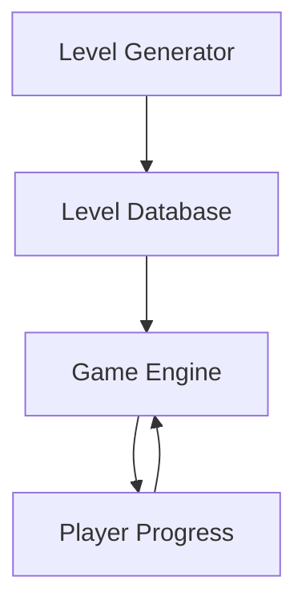
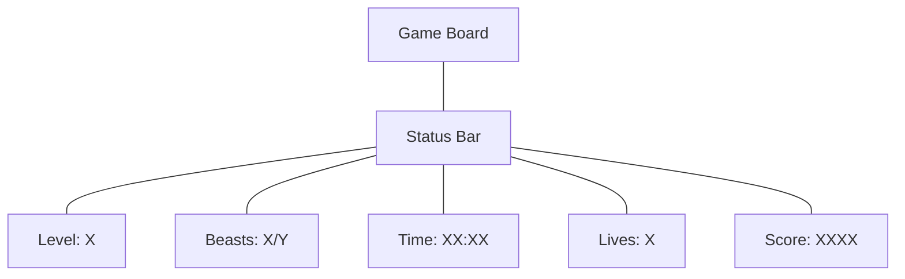
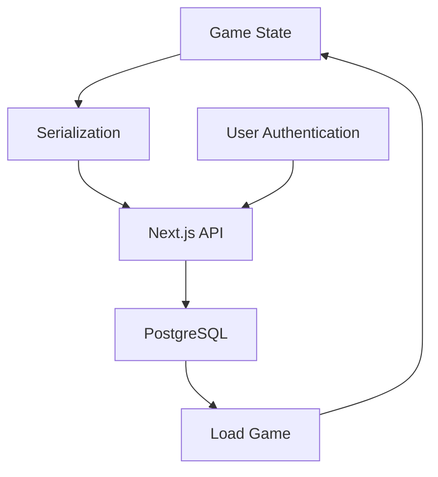
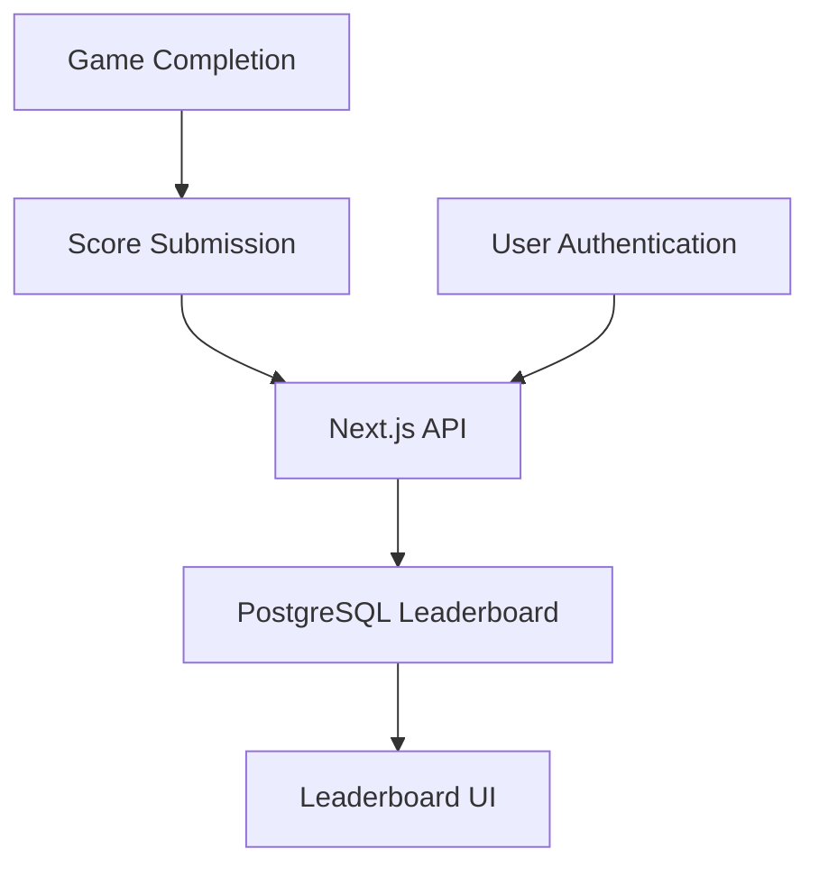
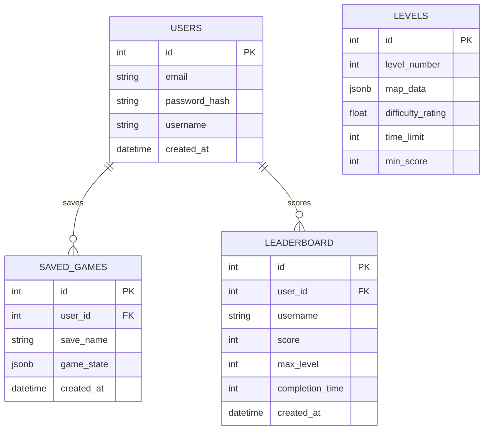
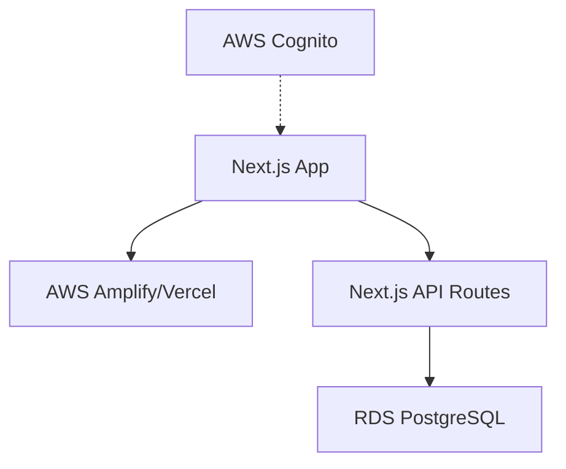

# Beast Game Extension Plan

This document outlines the plan for extending the Beast game with new features including level progression, status display, save game functionality, and a global leaderboard.

## 1. Level Progression System

### Architecture



### Implementation Details

1. **Level Generation System**
   - Create a `LevelGenerator` utility that extends the current `generateRandomMap` function
   - Add difficulty parameters that scale with level number:
     - Increase beast count and speed
     - Decrease block count
     - Increase maze complexity
     - Add time limits
   - Generate a set of levels (e.g., 50 levels) with increasing difficulty
   - Store these levels in a database table or JSON configuration file

2. **Level Management**
   - Create a `levels` table in PostgreSQL with:
     ```sql
     CREATE TABLE levels (
       id SERIAL PRIMARY KEY,
       level_number INTEGER NOT NULL,
       map_data JSONB NOT NULL,
       difficulty_rating FLOAT NOT NULL,
       time_limit INTEGER NOT NULL,
       min_score INTEGER NOT NULL
     );
     ```
   - Create Next.js API routes for level management:
     - `/api/levels` - Get all levels or a specific level
     - `/api/levels/generate` - Admin endpoint to regenerate levels

3. **Level Progression Logic**
   - Add state to track current level number
   - Add logic to load the next level when the current level is completed
   - Add conditions for level completion (all beasts eliminated)
   - Add logic to unlock levels as the player progresses

## 2. Level Status Display

### UI Design



### Implementation Details

1. **Status Component**
   - Create a new `StatusBar` component to display game status
   - Position it above or below the game board
   - Make it responsive for different screen sizes

2. **Game State Extensions**
   - Add new state variables to the `Game` component:
     ```typescript
     const [currentLevel, setCurrentLevel] = useState(1);
     const [timeElapsed, setTimeElapsed] = useState(0);
     const [lives, setLives] = useState(3);
     const [score, setScore] = useState(0);
     ```
   - Add a timer effect to track elapsed time:
     ```typescript
     useEffect(() => {
       if (gameOver || gameWon) return;
       const timer = setInterval(() => {
         setTimeElapsed(prev => prev + 1);
       }, 1000);
       return () => clearInterval(timer);
     }, [gameOver, gameWon]);
     ```

3. **Scoring System**
   - Award points for:
     - Eliminating beasts (100 points each)
     - Completing levels (500 points + time bonus)
     - Bonus for using fewer moves
   - Deduct points or lives when the player is caught by a beast

## 3. Save Game System

### Architecture



### Implementation Details

1. **User Authentication**
   - Implement authentication using NextAuth.js
   - Create user registration and login pages
   - Set up PostgreSQL tables for user data:
     ```sql
     CREATE TABLE users (
       id SERIAL PRIMARY KEY,
       email VARCHAR(255) UNIQUE NOT NULL,
       password_hash VARCHAR(255) NOT NULL,
       username VARCHAR(50) UNIQUE NOT NULL,
       created_at TIMESTAMP DEFAULT CURRENT_TIMESTAMP
     );
     ```

2. **Game State Serialization**
   - Create functions to serialize and deserialize game state:
     ```typescript
     function serializeGameState() {
       return {
         level: currentLevel,
         map: levelMap,
         player: player,
         beasts: beasts,
         blocks: blocks,
         timeElapsed: timeElapsed,
         lives: lives,
         score: score
       };
     }

     function deserializeGameState(state) {
       setCurrentLevel(state.level);
       setLevelMap(state.map);
       setPlayer(state.player);
       setBeasts(state.beasts);
       setBlocks(state.blocks);
       setTimeElapsed(state.timeElapsed);
       setLives(state.lives);
       setScore(state.score);
     }
     ```

3. **Save/Load API**
   - Create PostgreSQL table for saved games:
     ```sql
     CREATE TABLE saved_games (
       id SERIAL PRIMARY KEY,
       user_id INTEGER REFERENCES users(id),
       save_name VARCHAR(100) NOT NULL,
       game_state JSONB NOT NULL,
       created_at TIMESTAMP DEFAULT CURRENT_TIMESTAMP,
       UNIQUE(user_id, save_name)
     );
     ```
   - Create Next.js API routes:
     - `/api/saves` - GET to list saves, POST to create a new save
     - `/api/saves/:id` - GET to load a save, DELETE to remove a save

4. **UI for Save/Load**
   - Add a menu button to the game
   - Create a modal dialog for save/load operations
   - Add input for save name
   - Display list of existing saves with load/delete options

## 4. Global Leaderboard

### Architecture



### Implementation Details

1. **Leaderboard Database**
   - Create PostgreSQL table for leaderboard entries:
     ```sql
     CREATE TABLE leaderboard (
       id SERIAL PRIMARY KEY,
       user_id INTEGER REFERENCES users(id),
       username VARCHAR(50) NOT NULL,
       score INTEGER NOT NULL,
       max_level INTEGER NOT NULL,
       completion_time INTEGER NOT NULL,
       created_at TIMESTAMP DEFAULT CURRENT_TIMESTAMP
     );
     ```

2. **Score Submission**
   - Create function to submit score when game is completed or player runs out of lives:
     ```typescript
     async function submitScore() {
       if (!user) return; // Must be logged in

       const scoreData = {
         userId: user.id,
         username: user.username,
         score: score,
         maxLevel: currentLevel,
         completionTime: timeElapsed
       };

       await fetch('/api/leaderboard', {
         method: 'POST',
         headers: { 'Content-Type': 'application/json' },
         body: JSON.stringify(scoreData)
       });
     }
     ```

3. **Leaderboard API**
   - Create Next.js API routes:
     - `/api/leaderboard` - GET to retrieve leaderboard, POST to submit score
     - `/api/leaderboard/user/:id` - GET user's best scores

4. **Leaderboard UI**
   - Create a `Leaderboard` component
   - Display top scores with username, level, score, and date
   - Add filters for time period (all-time, monthly, weekly)
   - Add pagination for viewing more entries
   - Highlight the current user's position

## 5. Database Schema



## 6. AWS Infrastructure



### Implementation Details

1. **AWS Services**
   - RDS PostgreSQL for database
   - Amplify or Vercel for Next.js hosting
   - Optional: Cognito for authentication (alternative to NextAuth.js)
   - Optional: S3 for static assets

2. **Deployment**
   - Set up CI/CD pipeline for automatic deployment
   - Configure environment variables for database connection
   - Set up database migrations

## 7. Implementation Phases

### Phase 1: Level Progression and Status Display
1. Extend the Game component with level progression logic
2. Create the StatusBar component
3. Implement the scoring system
4. Add lives and game over handling

### Phase 2: User Authentication and Save Game
1. Set up NextAuth.js for authentication
2. Create user registration and login pages
3. Implement game state serialization
4. Create save/load API and UI

### Phase 3: Leaderboard
1. Create leaderboard database table
2. Implement score submission
3. Create leaderboard API
4. Build leaderboard UI component

### Phase 4: AWS Deployment
1. Set up RDS PostgreSQL instance
2. Configure Next.js for production
3. Deploy to AWS Amplify or Vercel
4. Set up monitoring and analytics

## 8. Technical Considerations

1. **State Management**
   - Consider using a state management library like Redux or Zustand for complex state
   - Alternatively, use React Context for sharing state between components

2. **Performance**
   - Optimize rendering of the game board for larger levels
   - Use memoization for expensive calculations
   - Consider using Web Workers for pathfinding algorithms

3. **Accessibility**
   - Add keyboard shortcuts for menu navigation
   - Ensure proper contrast for UI elements
   - Add screen reader support

4. **Security**
   - Implement CSRF protection
   - Validate all user inputs
   - Use prepared statements for SQL queries
   - Implement rate limiting for API endpoints

5. **Testing**
   - Write unit tests for game logic
   - Create integration tests for API endpoints
   - Set up end-to-end testing with Cypress